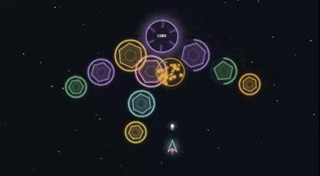
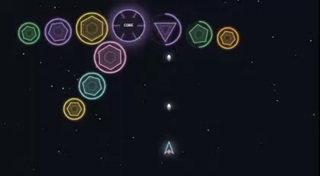
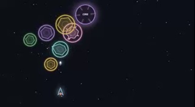

A canvas-based sandbox game built in vanilla JavaScript designed to explore morphing geometry math.
Players pilot a ship using mouse controls and hold-click to auto-fire at geometric shapes drifting across the screen.
Destructible targets morph down to triangles based on distinct mathematical behaviors, including Wave, Spiral, Curl, Shatter, Inflate, Pull,
and Elastic.
```
Mouse   : Move
LButton : Shoot
```
<br>
<br>

